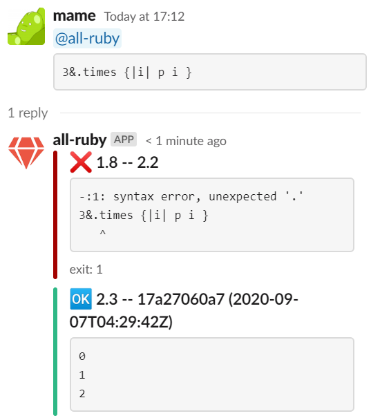

# all-ruby bot for Slack

A chat bot to run Ruby publicly

## Minimal Deployment

* Setup Slack App
  * Go to https://api.slack.com/apps and Create New App
  * Setup "Basic Information"
    * Create an "App-Level Token" with a scope: connections:write
    * Memo the token (starting with `xapp-`)
  * Setup "OAuth & Permissions"
    * Add Scopes: `app_mentions:read`, `chat:write`, and `reactions:write`
    * Memo "Bot User OAuth Access Token" (starting with `xoxb-`)
  * Setup "Event Subscriptions"
    * Subscribe to `app_mention` bot events
  * Setup "Socket Mode"
    * Enable Socket Mode
  * "Install App"
* Run all-ruby-bot.rb
  * with an environment varibale `ALL_RUBY_BOT_SLACK_BOT_TOKEN` set as the "Bot User OAuth Access Token"
  * with an environment varibale `ALL_RUBY_BOT_SLACK_APP_TOKEN` set as the "App-Level Token"
